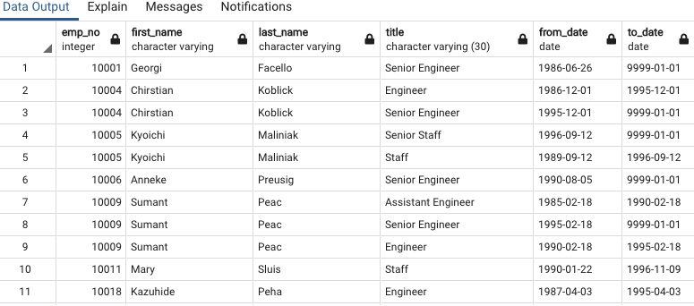
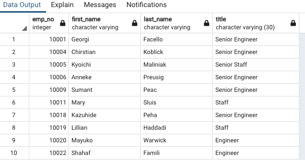
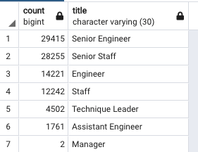

# Employees Analysis -- Overview
We've been tasked with determining the number of retiring employees per title and identifying current employees who are eligible to participate in a mentorship program.  

## Resources
- Data Source: employees.csv; titles.csv; dept_emp.csv; 
- Software: SQL; PostgreSQL

## Part 1 Summary
The first part of the analysis is to create a retirement table that holds all of the titles of current employees who were born between January 1, 1952 and December 31, 1955.  The second table removes instances where an employee may have multiple titles in the database so that the final table only contains the most recent title of each employee.  The final table shows the number of retirement-age employees by their most recent job title.  

## Part 2 Summary

## Recommendations
To address disparities in fares between rides, one recommendation is to charge different rates between Urban, Suburban, and Rural areas.  Another recommendation is to add an upfront fee that is contigent on the type of area.  A final recommendation is to tie rates to miles traveled so that the first mile is the most expensive, and gradually declines as vehicle miles increase.    
