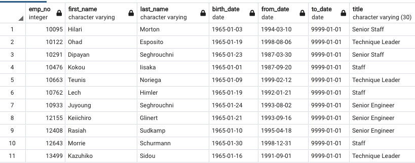

# Employees Analysis -- Overview
We've been tasked with determining the number of retiring employees per title and identifying current employees who are eligible to participate in a mentorship program.  

## Resources
- Data Source: employees.csv; titles.csv; dept_emp.csv; 
- Software: SQL; PostgreSQL

## Part 1 Summary
The first part of the analysis is to create a retirement table that holds all of the titles of current employees who were born between January 1, 1952 and December 31, 1955.  The second table removes instances where an employee may have multiple titles in the database so that the final table only contains the most recent title of each employee.  The final table shows the number of retirement-age employees by their most recent job title.  

## Part 2 Summary
In the second part of the analysis, we identified current employees who were born between January 1, 1965 and December 31, 1965.  The result is a table of employees who would be eligible to be a mentor at the company.   

## Results

In looking at the tables, we can draw the following conclusions:
- The Part 1 summary shows that there will likely be a huge wave of retirements over the next few years.  
- Among current employees, employees in Senior Engineer and Senior staff positions will be the most likely to retire.
- While there are several senior level positions that will be need to be filled, only 2 manager positions will need to be filled.  
- Part 2 of the analysis shows that there will be approximately 1,500 employees who could potentially assume mentorship type roles.  

## Conclusion
In running an additional query, there will be 90,938 roles that will likely need to be filled within the next few years.  While there will likely be a large number of retirees, there appears to be enough people to provide mentorship to younger members of the organization.  There are approximately 65,000 current employees with birth dates between Jan 1 1961 and December 31 1966.  It would be helpful to run an additional query on the number of potential mentees broken out by department and an additional query broken out by title and department.   

 
